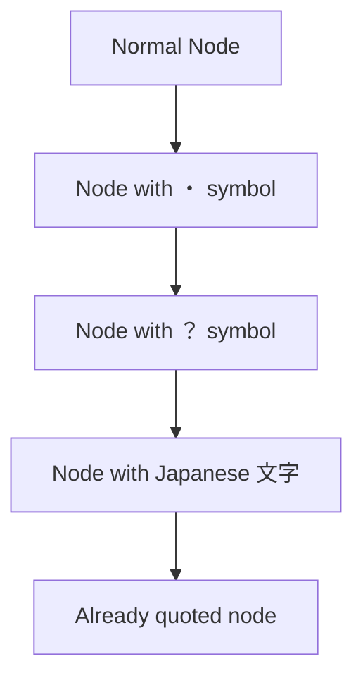

# Mermaid Test

This is a test file for Mermaid Label Formatter.

```mermaid
graph TD
    A[Normal Node] --> B[Node with ・ symbol]
    B --> C[Node with ？ symbol]
    C --> D[Node with Japanese 文字]
    D --> E["Already quoted node"]
```

More text here.